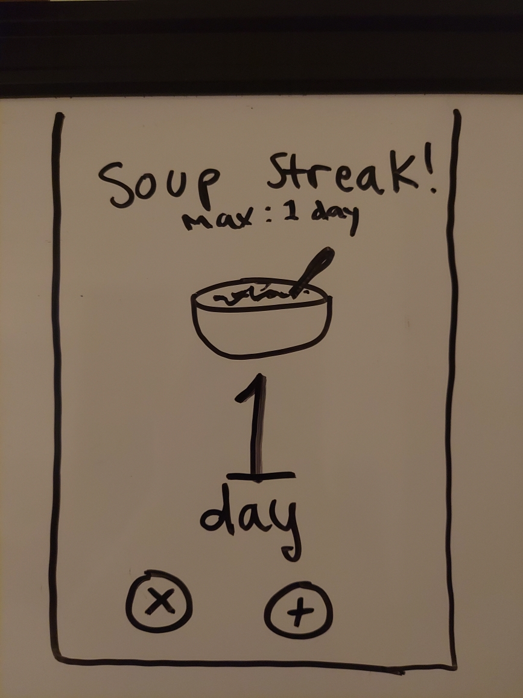
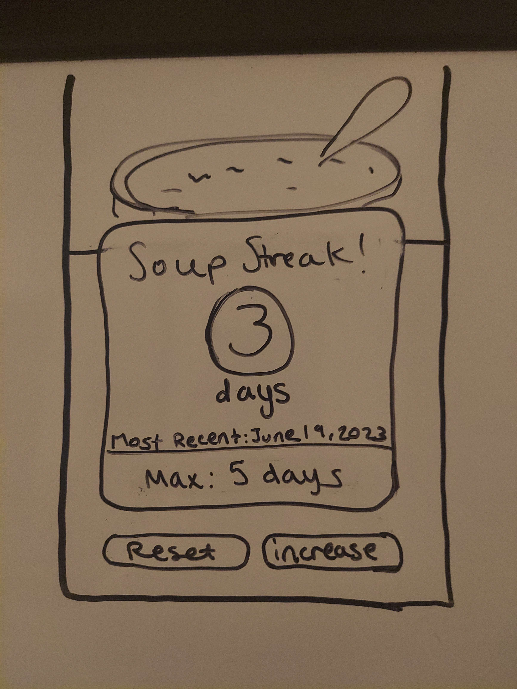

# README

## HW 3 - State Management

### States in an Android App

* **Active** - this is when the app is running and being used by the user, it is the app visible on the screen and includes partially active states (a navigation app running in the background or a music player)

* **Paused** - in this state, the app is only partially visible to the user but the user isn't interacting with it, because they switched to another app, or something popped up on top of it

* **Stopped** - the app is not visible to the user, either because they force stopped it in the phone's settings or the system stopped it

* **Destroyed** - the app has stopped running in memory, its resources are freed because the user closed it by swiping up, the system destroyed the app's process, or the app crashed

### States I must Consider

* **Active** - This is when the app is open and working, so obviously need to consider it. It needs to not crash if another app pops up on top, or something is running in the background.

* **Paused** - This is when the user has moved over to another app so they aren't looking at it anymore. It still needs to be listening for phone calls at this point so the user can decide if they want to stop the music. That would mean the bluetooth connection still needs to be held.

* **Stopped** - At this point the bluetooth connection will be stopped. Incoming calls won't trigger a dialog asking to pause the music. The information about the paired device will still remain. Memory has been freed up.

* **Destroyed** - Like what happened in the stopped state, but it happens because the user swiped up to close it, rather than force stopping it.

### App Assignment

The theme of this app comes from something I did as a joke almost a year ago. The inspiration comes from a conversation that went a little like this:

Friend: I made soup.

Me: Didn't you have soup yesterday and the day before? You're on a soup streak.

Friend: But soup is good!

Me: I'm going to make an app that counts every time you eat soup.

I made this doodle to show that I wasn't kidding.

I didn't know how to make the number persist among state changes. Until now.

The UI changed after the initial design.

The app will hold its state when switching apps (paused state) and when closing the app (destroyed state)

## HW2 - Basic Storage

### Approaches to Storage on Android

* **DataStore** - used for key-value pairs, it's the preferred way to stored data compared to SharedPreferences. It is good for small and simple datasets, but it does not support partial updates or referential integrity. There are two different versions: Preferences DataStore and Proto DataStore

  * Preferences DataStore - it is simple to set up, but lacks type safety.

  * Proto DataStore - requires a predefinted schema using protocol buffers so it has more work involved. However, you have the advantage of customization. It also provides type safety.

* **SharedPreferences** - this is the old way to store key-value pairs of data. It's good for information about the user's preferences, like if they prefer a light or dark mode UI theme or other UI configurations. It works in Java and Kotlin. The downside is that it is now depreciated and could potentially lose data if the app crashes.

* **Private files** - use files to store in the app's internal storage directory. It was easy enough to do since this is what I used for this assignment. You can store more than just key-value pairs, like images and objects. The disadvantage is that it can be slow for large files, and they are only accessible in your app.

* **Room** - included with the Jetpack library, Room is good for data that needs persistence, like if the device goes offline, the user can still access media that was cached in Room. It is preferred (by Google it seems) over using SQLite directly. It has the benefit of type safety but potentially more complex since it builds upon SQLite. I'll look into it for my project.

* **SQLite** - a lightweight database that uses direct SQL queries. I am familiar with SQL and have worked with SQLite so this could be an option I use. It is good for simple projects. While it can be hard to prevent errors if you have to write everything manually, its okay because I am fond of relational databases.

* **Cloud storage** - the major advantage of could storage is that you can access it anywhere. I wouldn't use it for this project because it's not needed, but for a project I want to do a mobile app and a web app that work together, I'd need to use cloud storage. The data is also secure. The downside is that it requires an internet connection, so if you happen to lose connection it won't work. Most importantly, it costs money and the bigger your app scales the more you'll need to pay.

* **SD card** - having media stored on an SD card can be a convenient way to gain access to storing large files on the device. The downside is that not ever device may have a SD card or one that will have enough memory. They can be slow and lacking in security. But you can use the data offline and transfer it between devices. It's not something I'd use for my near-future projects.

## HW0 - Getting Started

### Indented platform

* 💚 **Android** 💚 - I have an Android phone and I only have experience with Android. Please note that when I say "experience" it is very limited, but hopefully by the end of this project I will have a project I can be proud of.

### Indented framework/programming language

* 💜 **Kotlin** 💜 - I have dabbled in Kotlin but a while back I took an app class where we followed tutorials in Java. Kotlin is a lot nicer than Java from what I've experienced. Plus, its' Google's preferred language and would be desirable to future employers.
* 🚀 **Jetpack Compose toolkit** 🚀 - Also dabbled with this as I was following a course from Google. I like it so I want to continue with it and get some practice with this project.
* 📱 **Material 3 for UI** 📱 - I am a big fan of style standards and best practices. I saw a demo of M3 at a conference and I was sold. It would be really helpful to me as I am not a designer and need some assistance with what's the right way to do it.

### Cross-platform exploration

* 🚫 **Not at this time** 🚫 - I considered React Native but I have zero experience with it. Perhaps in the future when I am more competent in Android development, I will try it out.
